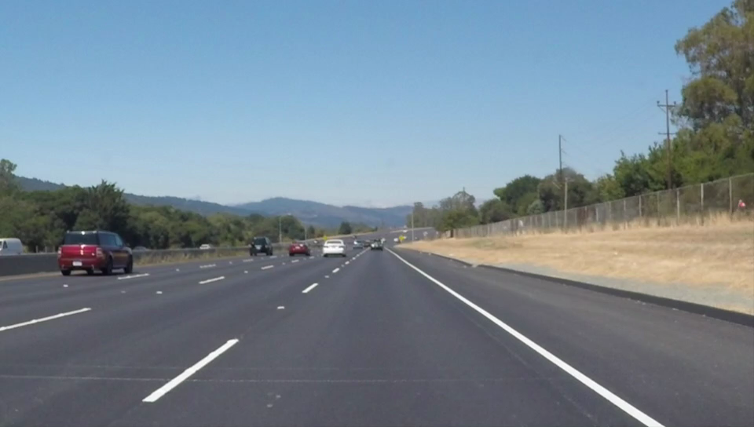
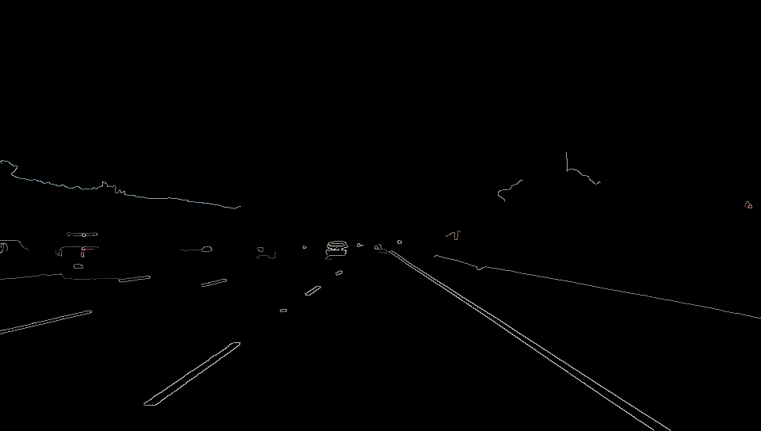
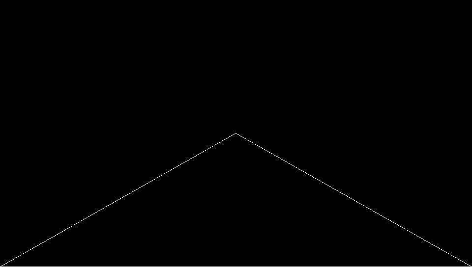
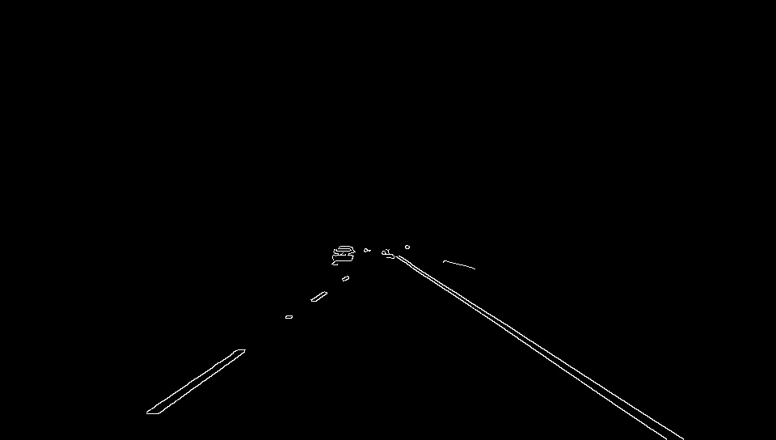
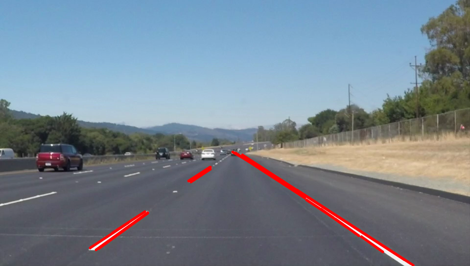

# Basic Lane Detection


## Process
1. First input the image

```cpp
img = imread(test3.png);
```


2. Perform lane detection on the image and store the final image into dst

```cpp
cvtColor(img, greyscale_img, COLOR_BGR2GRAY);

blur(greyscale_img, greyscale_blur_img, Size(3, 3));

Canny(greyscale_blur_img, greyscale_blur_img, 100, 300, 3);

dst =Scalar::all(0);

img.copyTo(dst, greyscale_blur_img);
```



3. Process for edge detection begins

- First to make sure that the image is greyscale we convert the image into greyscale ,as edge detection is only possible on greyscale image.

```cpp
Mat inputImage = dst;
if (inputImage.channels() \&gt; 1)
{
cv::cvtColor(inputImage, inputImage, CV\_RGB2GRAY);
}
```
4.  Here we define the Region of an interest in an image .It is basically the region in the whole picture where we have to detect the lanes.I chose a ROI as a triangle in front of the camera of a car to detect the lanes.Hence the images which are taken from the perspective of a car front dash cam perform better in the test.

- For defining ROI.First I declare the co-ordinates
```cpp
int x0 = img.cols - 1;
int y0 = img.rows - 1;
int x1 = img.cols/2 - 1;
int y1 = img.rows/2 - 1;
int x2 = 0;
int y2 = img.rows – 1;
```
- Then I make these lines on a black background and store in it LineMask image
```cpp
cv::Mat lineMask = cv::Mat::zeros(inputImage.size(), inputImage.type());
cv::line(lineMask, cv::Point(x0, y0), cv::Point(x1, y1), cv::Scalar(255, 255, 0), 1, 8, 0);
cv::line(lineMask, cv::Point(x0, y0), cv::Point(x2, y2), cv::Scalar(255, 255, 0), 1, 8, 0);
cv::line(lineMask, cv::Point(x1, y1), cv::Point(x2, y2), cv::Scalar(255, 255, 0), 1, 8, 0);
```



5. Now ,In order to Crop the image in this area,we will have to create a binary mask.

- To create a binary mask,we have to perform contour detection on the image. This basically identifies the shape present in the image.It only function precisely in a black and white image ,hence linemask was made by white lines on a black background;
```cpp
vector<vector<Point>>contours;
vector<cv::Vec4i>hierarchy;
cv::findContours(lineMask, contours, hierarchy, CV_RETR_TREE, CV_CHAIN_APPROX_SIMPLE, cv::Point(0, 0));
```
- After this test we perform a point polygon test ,which basically tells us which points lie inside the detected object and which points lie outside.We capture all this data in a matrix called raw_dist;

```cpp
cv::Mat raw_dist(lineMask.size(), CV_32FC1);
for (int i = 0; i<lineMask.rows; i++)
{
 for (int j = 0; j<lineMask.cols; j++)
 {
  raw_dist.at<float\>(i, j) = cv::pointPolygonTest(contours[0], cv::Point2f(j, i), true);
 }
}
```
- Using the data stored in the raw_dist matrix,we create the required binary matrix(mask);
```cpp
cv::Mat mask = cv::Mat::zeros(inputImage.size(), CV\_8UC1);
for (int i = 0; i<mask.rows; i++)
{
for (int j = 0; j<mask.cols; j++)
{
if (raw_dist.at<float>(i, j)<0)\\point outside the mask
{
mask.at<uchar>(i, j) = static_cast<uchar>(0);
continue;
}
mask.at<uchar>(i, j) = static_cast<uchar>(255);\\point inside the mask
}
}
```


6. We now crop the required region of interest using the above mask from the image and store it into output image;
```cpp
cv::Mat invInput = inputImage;

cv::Mat outputImage;

invInput.copyTo(outputImage, mask);
```




7. Now we use hough transform to detect any straight lines present in the image and store the end points of the lines in a vector

```cpp
vector<Vec4i>linesP; \\will hold the results of the detection

HoughLinesP(outputImage, linesP, 1, CV_PI 180, 20, 20, 30); \\runs the actual detection
```
8. Now I have used the endpoints to calculate slope to avoid a line that is too horizontal to get printed
Now display all the detected line on the initial image
```cpp
double slope_thresh = 0.3;
for (size_t i = 0; i<linesP.size(); i++)
{
Vec4i l = linesP[i];
double slope = (static_cast<double>(l[3]) - static_cast<double>(l[1])) (static_cast<double>(l[2]) - static_cast<double>(l[0]) + 0.00001);
if (std::abs(slope)>slope_thresh)
line(img, Point(l[0], l[1]), Point(l[2], l[3]), Scalar(0, 0, 255), 3, LINE_AA);
}
```

